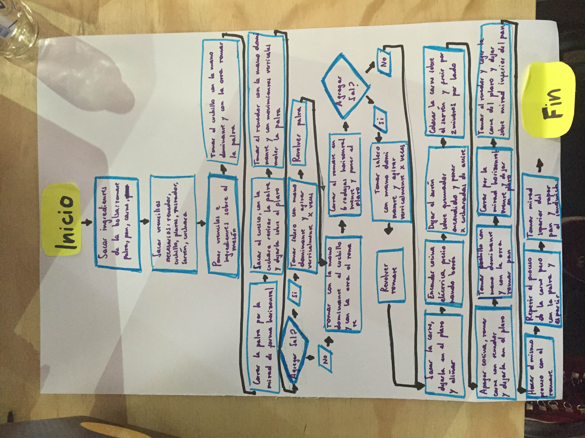

#Proyecyo laboratoria utils <!--titulo-->

##### Este proyecto tiene una descripcion en _markdown_  <!--negrita-->

#### Este proyecto hace:

*Clona los proyectos de las estudiantes <!--lista desordenada 3 item-->
*Abre las gh-pages automaticamente
*Revisa que repositorios remotos existan

Para mas informacion: [Ir a laboratoria(http://laboratoria.la/)]

